# SCIG Schedule Simulator

A static, browser-based simulator for comparing subcutaneous immunoglobulin (SCIG) schedules. It compares relative exposure shape, model-derived IgG bands, dose intensity, infusion-site burden, estimated infusion time, switch scenarios, and extended dose gaps.

The simulator is descriptive and comparative. It does not estimate an individual patient's true serum IgG concentration, fit patient-specific pharmacokinetic parameters, predict clinical outcomes, or recommend a dose or dosing interval.

## Intended Use

Patients can use the simulator to compare the practical burden and modeled tradeoffs of possible schedules, explore what the model shows when a subsequent dose is withheld, and prepare more specific questions for a clinician. A patient-facing scenario should normally start from one of the two built-in profiles, adjust the weight/dose, and leave the advanced assumptions unchanged.

You can reproduce a current regimen as the reference, construct simple or split-dose comparators, inspect modeled exposure and operational burden, and use the Extended Interval Explorer to plan which schedules, symptoms, or laboratory timepoints may be worth discussing or monitoring. Advanced assumptions remain visible for sensitivity analysis and documentation of the model configuration.

The output supports shared discussion rather than a dosing decision. A shared link contains the model configuration, not a private clinical record, so that the simulator can be shared and the next viewer (a caregiver/loved one or a clinician) is starting from the same view with the same configuration.

## Guided Examples

These are synthetic discussion examples, not dosing recommendations. The modeled IgG values depend on editable assumptions and should be interpreted alongside symptoms, measured labs, product instructions, and the prescribing clinician's judgment.

### Example 1: 55 kg replacement / PI-style discussion

Start with the **Replacement / PI-style default**, enter **55 kg**, and review the product-rounded reference. With the default Hizentra preset, the requested `0.1 g/kg/week` becomes **6 g / 30 mL every 7 days**.

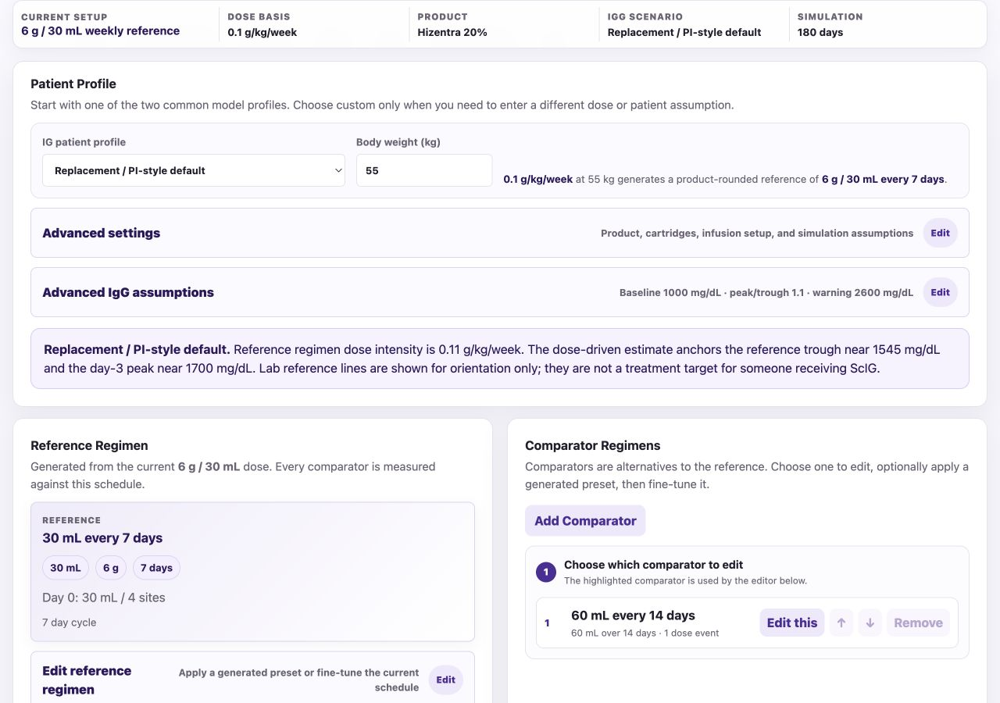

To explore a dose-equivalent longer interval, keep the weekly regimen as the reference and create a comparator of **60 mL every 14 days**. This doubles the per-cycle dose while preserving the modeled weekly amount:

- weekly volume: `30 mL` versus `30 mL`
- weekly dose: `6 g` versus `6 g`
- dose intensity: `100%` versus `100%`
- infusion days per 28 days: `4` versus `2`
- maximum volume per site: `7.5 mL` versus `15 mL`

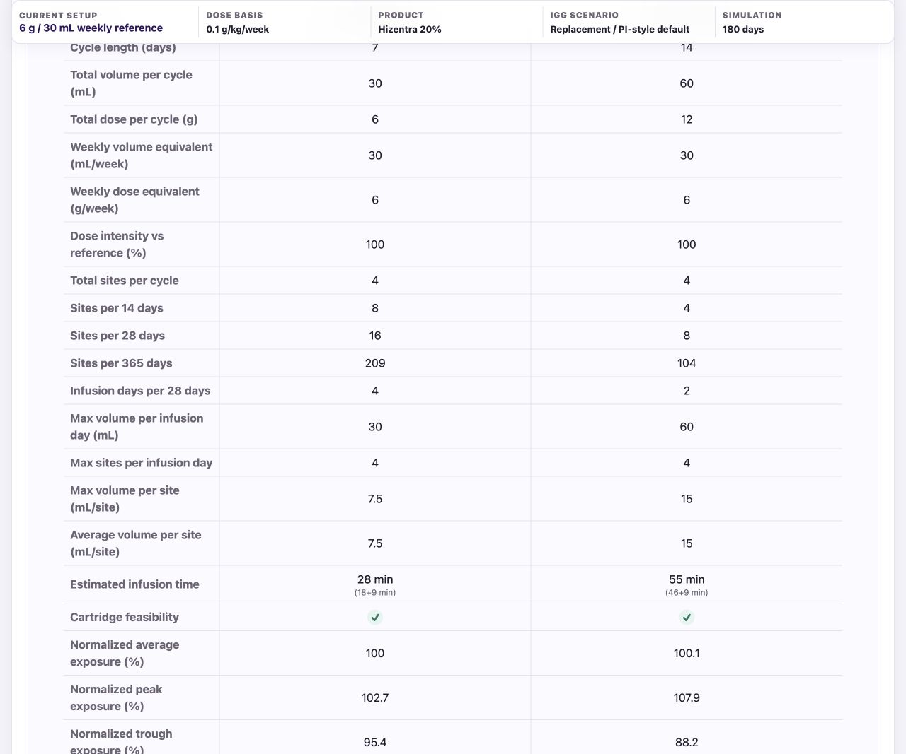

The comparison is useful because matching the weekly dose does not make the schedules operationally or pharmacokinetically identical. In this example, the 14-day schedule produces fewer infusion days but a larger single-session volume and a wider modeled peak-to-trough range. Comparator cartridge mixes are allocated independently from the product's available presentation sizes, so the doubled dose is evaluated using its own feasible mix rather than the weekly reference's selected cartridges. The 60 mL comparator uses a `50 mL + 10 mL` combination and is therefore shown as feasible, with an estimated infusion time of `55 min (46+9 min)`.

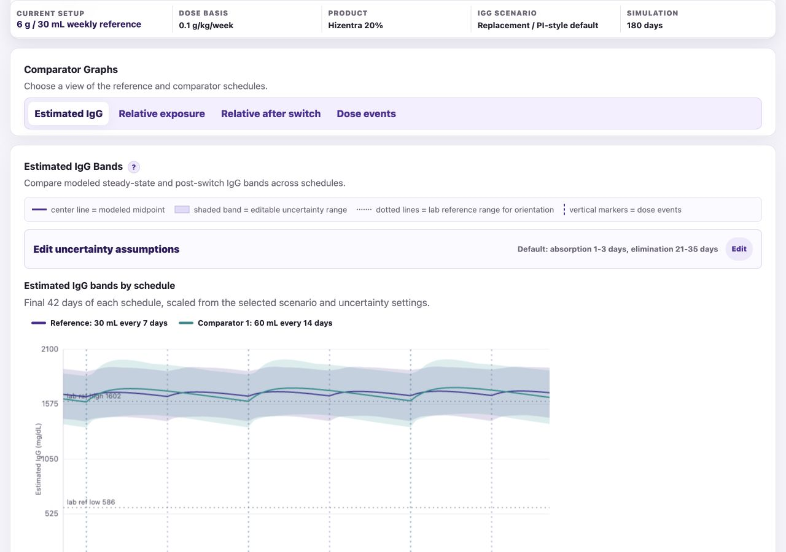

Questions a patient or clinician might use this view to frame include:

- Does reducing infusion frequency justify the larger per-session volume and site burden?
- Would a split 14-day cycle be more practical than giving the doubled amount at once?
- Which symptoms or lab timepoints would be useful to track if an interval change were being considered clinically?

### Example 2: 75 kg high-dose neurologic / CIDP discussion

Select the **High-dose neurologic default** and enter **75 kg**. The generated reference is **30 g / 150 mL every 7 days** at the default `0.4 g/kg/week` assumption. “CIDP” here describes the discussion scenario; the simulator does not model CIDP symptoms, disease activity, or clinical outcomes.

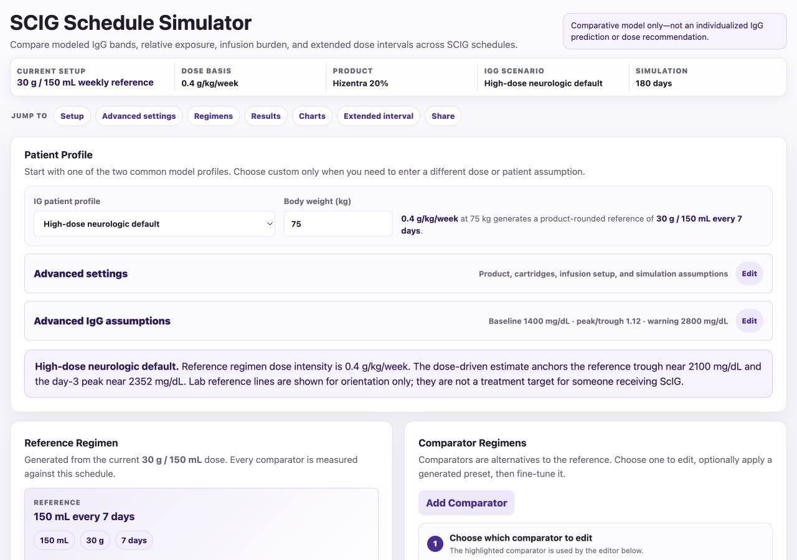

Compare the same **150 mL** cycle dose every **7, 10, and 14 days**. The 10-day comparator is made by editing the generated 9-day comparator to 10 days; the 14-day comparator can use the generated preset.

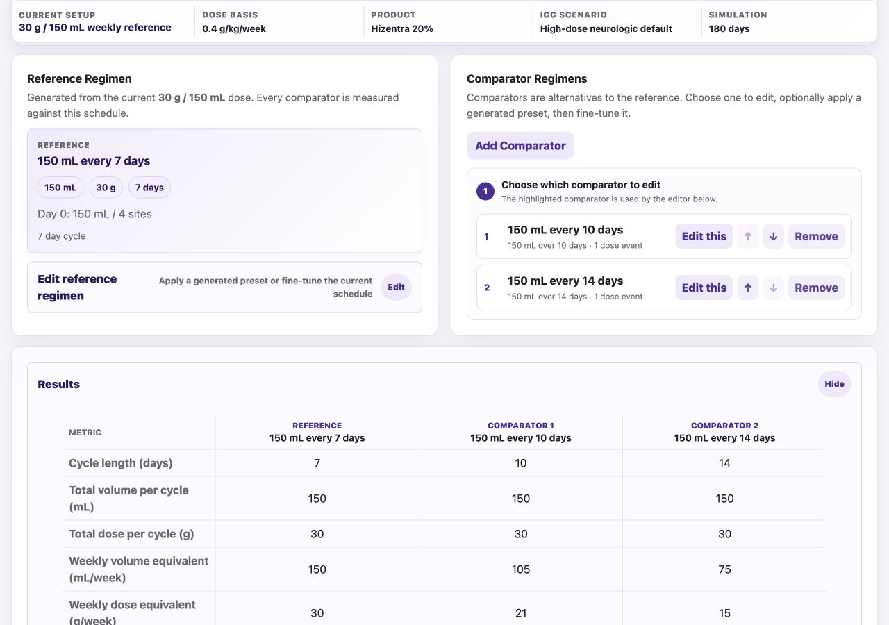

Here the amount per infusion stays the same, but the average weekly dose falls as the interval grows:

- every 7 days: `30 g/week`, `100%` of reference dose intensity
- every 10 days: `21 g/week`, `70%` of reference dose intensity
- every 14 days: `15 g/week`, `50%` of reference dose intensity

The results table helps separate burden changes from exposure changes. The modeled-band view then shows how the same per-infusion amount produces lower average exposure when it is given less often.

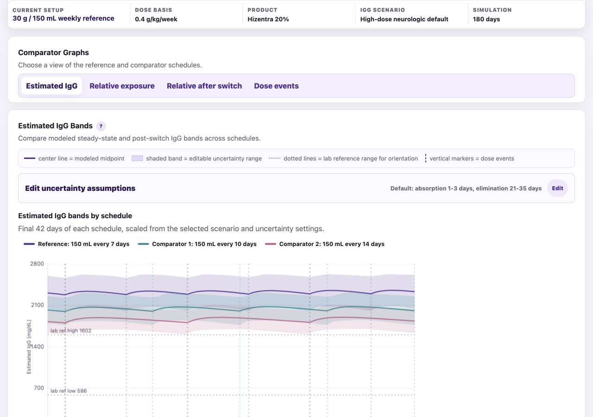

The **Extended Interval Explorer** answers a different question: what does the model show if the next dose is not taken at all? It starts from a stable selected regimen, includes the final dose at day 0, withholds every later dose, and follows the band toward the non-zero endogenous baseline. In this example, day 21 is selected to inspect the modeled band two weeks beyond the usual weekly event.

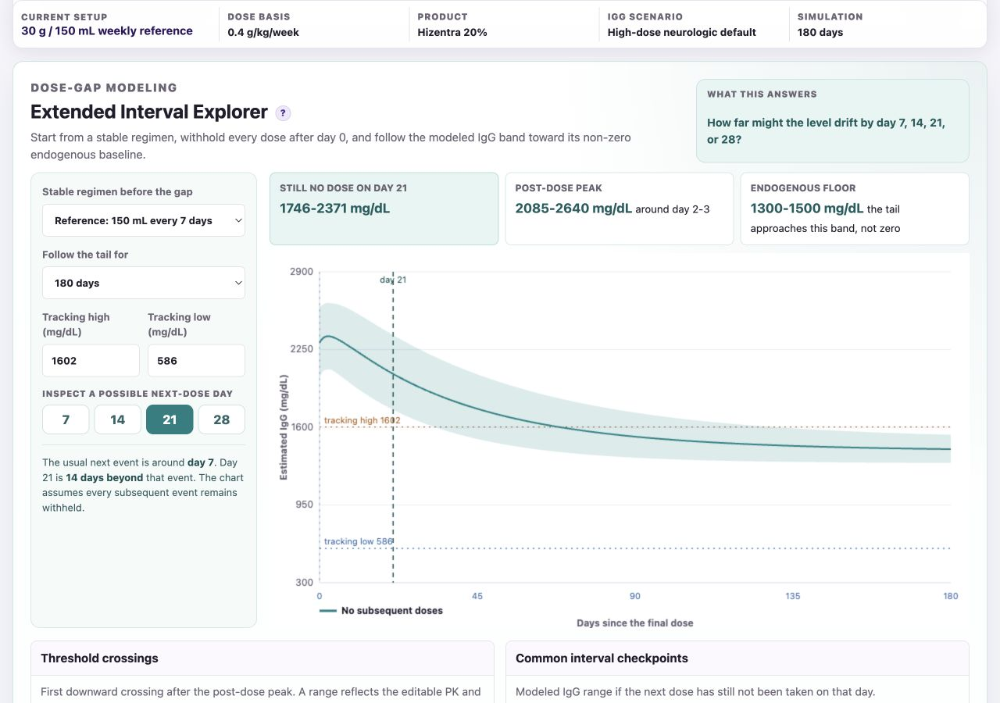

This can help someone plan a clinician discussion about which interval checkpoints, symptom observations, or measured laboratory values would be informative. It does not identify a safe next-dose day or recommend extending an interval.

## Share a Configuration

Open **Share or export this setup** and choose **Copy Link**. The URL records the selected profile and other inputs that differ from the simulator defaults. Generated dose amounts, cartridge allocations, and standard schedules are rebuilt from those inputs instead of being repeated in the URL; manually edited regimens and assumptions are retained as compact overrides. A recipient opening the link starts from the same configuration and can then edit their own copy.

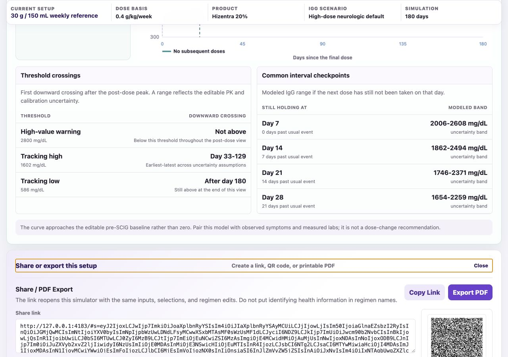

The link uses the site address from which the simulator is currently running:

- local testing creates a `http://127.0.0.1:4183/...` or `file://...` link that generally works only in that local environment;
- a deployed GitHub Pages copy creates a compressed HTTPS link such as `https://danamlewis.github.io/ScIGPilot/?s=...`, which can be opened on another device and pasted as a complete link in messaging apps;
- the QR code contains the same link as **Copy Link**.

Configure the scenario on the deployed site before copying a link intended for someone else. Shared links are readable configuration data: do not put names, dates of birth, identifiers, or other sensitive health information in regimen names.

## Five-Page PDF Report

Choose **Export PDF** to create a dated, letter-size report from the configuration currently open in the simulator. The five pages cover:

1. patient profile, product, dose, and compared schedules;
2. burden, feasibility, and normalized model metrics;
3. modeled IgG bands by schedule and after switching;
4. relative exposure across the simulation and after switching; and
5. the extended-interval tail, threshold crossings, checkpoints, and a link/QR code that reopens the setup.

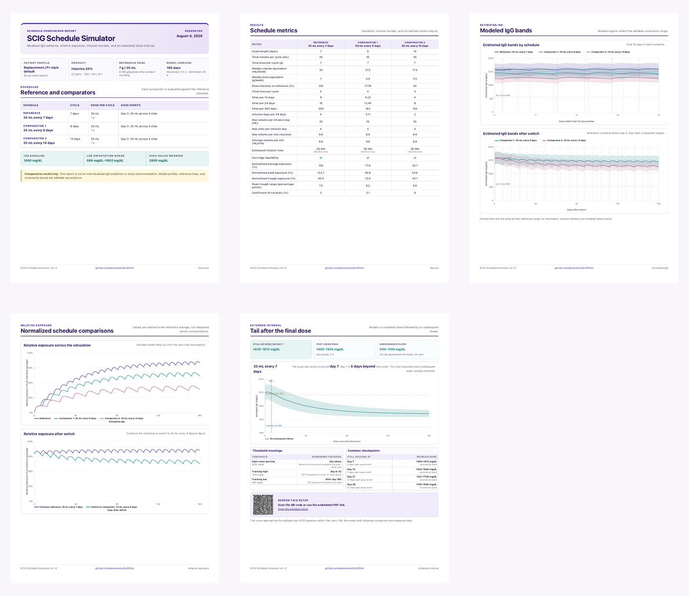

The exported charts use the same schedule names and visual encoding as the browser views:

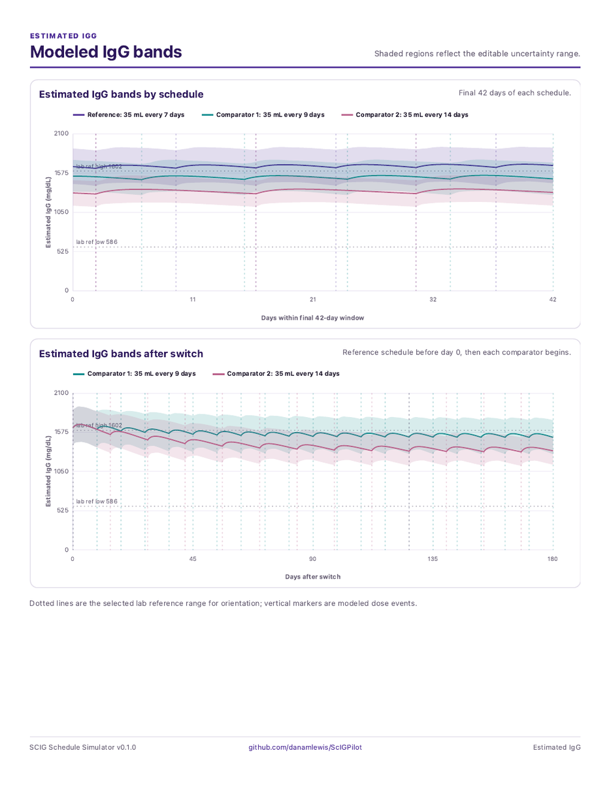

The final page keeps the non-zero endogenous floor, checkpoint table, and reopening link together:

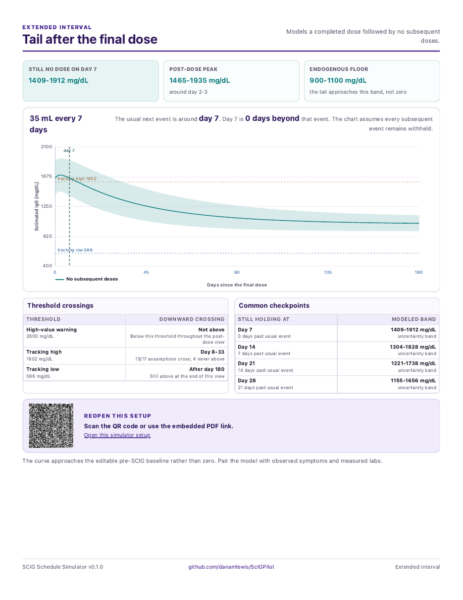

The sample PDF screenshots above use the repository's verified default 65 kg replacement / PI-style configuration to show the report layout. A new export is rebuilt from the simulator state that is open when **Export PDF** is selected.

## Documentation

- [MODEL.md](MODEL.md) describes the equations, variable types, defaults, uncertainty construction, outputs, and limitations.
- [REFERENCES.md](REFERENCES.md) maps external sources to the product, laboratory, pharmacokinetic, and infusion-device assumptions they inform.
- [CONTRIBUTING.md](CONTRIBUTING.md) for those who would like to contribute improvements
- [SECURITY.md](SECURITY.md) explains how to report vulnerabilities without publishing sensitive details.
- [THIRD_PARTY_NOTICES.md](THIRD_PARTY_NOTICES.md) records licenses and attribution for included or runtime dependencies.
- [LICENSE](LICENSE) contains the project's MIT license.

## Run Locally

Open `index.html` in a modern browser, or serve the repository root with any static web server. For example:

```bash
python3 -m http.server 4183
```

Then open `http://127.0.0.1:4183/`.

The application has no backend. Chart.js 4.4.1 and the QR generator are vendored in the repository, so the simulator does not need a third-party runtime request. If Chart.js is unavailable, the application draws simplified canvas fallbacks for the affected relative-exposure charts.

For development and tests, install the locked dependency set with a supported Node.js version:

```bash
npm ci
npm test
```

## Product Presets

The built-in U.S. product presets are:

| Product | Concentration | Cartridge sizes represented in the simulator |
| --- | ---: | --- |
| Hizentra | 20% (`0.2 g/mL`) | `5`, `10`, `20`, `50 mL` |
| Cuvitru | 20% (`0.2 g/mL`) | `5`, `10`, `20`, `40`, `50 mL` |
| Xembify | 20% (`0.2 g/mL`) | `5`, `10`, `20`, `50 mL` |

The concentration and available sizes are based on the U.S. labeling linked in [REFERENCES.md](REFERENCES.md). The simulator uses **cartridge** as its generic operational term for a selected unit of product; the official labeling may describe a vial or prefilled syringe. Product selection changes concentration, feasible volume combinations, and infusion-time calculations. It does not select a product-specific pharmacokinetic equation.

Product and device names are used for identification. The project is not affiliated with or endorsed by their manufacturers.

## Basic Workflow

1. Select an IG patient profile.
2. Use its generated reference regimen or select a custom profile and enter a dose.
3. Compare the generated 9-day and 14-day schedules, or edit the reference and comparator schedules.
4. Review burden and relative-exposure metrics.
5. Inspect estimated IgG bands, switch behavior, and the Extended Interval Explorer.

Requested reference doses are rounded to the nearest feasible volume made from the selected product sizes. When reference cartridge selection is manual, the page blocks downstream outputs if those selected counts do not match the product-rounded reference dose. Comparator events are evaluated independently and automatically allocated from the product's available presentation sizes.

## What the Model Does

Each dose event contributes a one-compartment, first-order absorption and first-order elimination curve. Contributions from repeated events are added together. Relative exposure is normalized to the reference regimen's final 28-day average.

The estimated IgG views add an editable endogenous baseline and scale the treatment-derived curve to an illustrative scenario anchor. The shaded bands are the envelope of combinations of editable baseline, dose-slope, absorption, and elimination assumptions. They are sensitivity bands, not confidence intervals or patient prediction intervals.

The Extended Interval Explorer assumes that the selected regimen has been repeated long enough to establish dose history, includes the final dose at day 0, withholds all later doses, and follows the modeled curve toward the non-zero baseline. Its standard checkpoints are days 7, 14, 21, and 28.

See [MODEL.md](MODEL.md) for the complete specification.

## Infusion-Time Estimate

The infusion-time calculation uses a nominal 26G needle-set/precision-tubing flow table and then applies an editable calibration where `F2400 + 4 sites + 50 mL` defaults to `46 minutes`.

For each infusion day:

```text
total flow = flow per site × number of sites × calibration factor
run time = cartridge volume ÷ total flow
infusion-day time = sum of sequential cartridge run times
```

This is a burden estimate tied to simplified product and device assumptions. It is not an administration instruction and does not replace product labeling, device instructions, prescribed rates, site limits, or individual tolerability.

## Privacy and Shared Links

The application has no accounts, analytics, backend database, or server-side storage. Inputs remain in the browser unless the user copies, prints, or shares them.

Shared links encode the simulator configuration in the URL. Anyone who receives such a link can read the encoded settings and regimen names. Do not enter identifying or sensitive health information in free-text names. A `file://` link is local to one computer; publish or serve the application over HTTPS before expecting shared links or QR codes to work on another device.

Incoming shared state is treated as untrusted: tokens and collection sizes are limited, numeric values are bounded, enumerations are allow-listed, internal comparator IDs are regenerated, and rendered names are HTML-escaped.

## Synthetic Defaults and Data Handling

All built-in patient profiles and numerical model anchors are illustrative or sourced population/product assumptions documented in [MODEL.md](MODEL.md) and [REFERENCES.md](REFERENCES.md). The repository does not contain a saved patient record, a measured laboratory history, or an individualized regimen fixture. Tests use synthetic schedules and names only.

## Tests

Run every check with:

```bash
npm ci
npm test
```

The locked test dependency is `jsdom`. The GitHub Actions workflow runs the same suite before a Pages deployment, and Dependabot is configured to check the npm and GitHub Actions dependencies monthly.

## GitHub Pages

The repository includes `.github/workflows/pages.yml`. On pushes to `main`, it:

1. installs dependencies from `package-lock.json`;
2. runs `npm test`; and
3. deploys the static repository through the GitHub Pages artifact workflow only after tests pass.

In the repository's GitHub settings, set **Pages → Build and deployment → Source** to **GitHub Actions**. Pull requests run tests but do not deploy. The deployment artifact contains the four application files plus the vendored Chart.js runtime and license in `vendor/`.

## Repository Layout

```text
index.html              page structure and controls
styles.css              responsive and print styling
script.js               model, state, rendering, charts, and interaction
qrcode.js               vendored QR generator
vendor/                 vendored Chart.js runtime and upstream license
docs/images/             README walkthrough and sample-report screenshots
package.json            test commands and supported Node.js versions
package-lock.json       reproducible development dependency lock
tests/infusion.test.js  model and serialization tests
tests/share-ui.test.js  DOM, UI, QR, and hydration tests
MODEL.md                model specification and variable classification
REFERENCES.md           source and attribution notes
CONTRIBUTING.md          contribution and health-data hygiene guidance
SECURITY.md              vulnerability-reporting guidance
THIRD_PARTY_NOTICES.md   third-party attribution and license notices
LICENSE                  MIT project license
.github/workflows/       automated tests and GitHub Pages deployment
```

## Known Boundaries

The simulator intentionally excludes:

- measured laboratory-data entry or patient-specific parameter fitting
- clinical recommendations or dose-adjustment advice
- diagnosis-specific pharmacodynamic or outcome modeling
- infection-risk or symptom prediction
- bioavailability differences between product presets
- accounts, authentication, and backend storage

## License

The SCIG Schedule Simulator is available under the [MIT License](LICENSE). Third-party components retain their own copyright notices and license terms as recorded in [THIRD_PARTY_NOTICES.md](THIRD_PARTY_NOTICES.md).

After creating the public GitHub repository, enable GitHub private vulnerability reporting so security reports can follow the process in [SECURITY.md](SECURITY.md).
